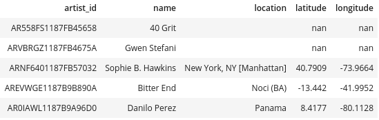

# Sparkify PostgreSQL database
In this project, I apply what I have learned on data modeling with Postgres and I build an ETL pipeline using Python. To complete the project, I will need to define fact and dimension tables for a star schema for a particular analytic focus, and write an ETL pipeline that transfers data from files in two local directories into these tables in Postgres using Python and SQL.

## Purpose of this database in the context of the Sparkify
 
This is a Sparkify official initialization of basic ETL process. We wants to analyze the data which been collecting on songs and user activity on our  music streaming app. Database was created for the analytics team, which is particularly interested in understanding what songs users are listening to.  Data will resides in a directory of JSON logs on user activity on the app, as well as a directory with JSON metadata on the songs in our app.

Postgres database with tables designed to optimize queries on song play analysis. My role was to created a database schema and ETL pipeline for this analysis. The database was tested and deployed on our local enviromenet, to access into the database please contact with  

 **Rafal Bodziony: bodziony.rafal@gmail.com**.
## State and justify database schema design and ETL pipeline  

The goal of this project is to facilitate the analysis of song data and customer logs. The database has been optimized for queries provided by the analytical team. The database was created in a star schema. The data flow process and the database schema are shown below.  
**ETL pipeline**  
  


**Database schema**  
  

### How to run
In order to properly create and run scripts, you need to correctly establish a database connection. The user connects to the database through the following data
```SQL
host=127.0.0.1
dbname=studentdb 
user=student 
password=student")
``` 
  
This data is entered in the create_table.py script. At the time of data migration, the access data will be changed and you will need to contact with the data engineer team.
To run ETL pipeline first create all tables with `create_tables.py`
```
user:~/project_dir$:python create_tables.py
```

Then the output should be:

```
user:~/project_dir$:Successfully create database user=student password=xxx dbname=studentdb host=127.0.0.1
user:~/project_dir$:Drop tables from user=student password=xxx dbname=sparkifydb host=127.0.0.1
user:~/project_dir$:Create tables in user=student password=xxx dbname=sparkifydb host=127.0.0.1
user:~/project_dir$:Tables are ready to use in user=student password=xxx dbname=sparkifydb host=127.0.0.1 
```

To insert data into database run `etl.py` script

```
user:~/project_dir$:python etl.py
```

Then You should see how many files was found, progress loop  and
information about success.

To test basic query use notebook `test.ipynb`  
 **REMEMBER**: Restart this notebook to close connection to  `sparkifydb`.
Each time you run the cells remember to restart notebooks to close the connection to your database. Otherwise, you won't be able to run your code in  `create_tables.py`,  `etl.py`  files since you can't make multiple connections to the same database.


## Example queries and results for song play analysis

**To select all songplays columns, query:**  
````SQL
SELECT * FROM songplays LIMIT 3;
````


**To select all users columns, query:**  
````SQL
SELECT * FROM users LIMIT 5;
````


**To select all artists columns, query:**  
````SQL
SELECT * FROM artists LIMIT 5;
````


**To select all songs columns, query:**  
````SQL
SELECT * FROM songs LIMIT 5;
````


**To select all time columns, query:**  
````SQL
SELECT * FROM time LIMIT 5;
````
